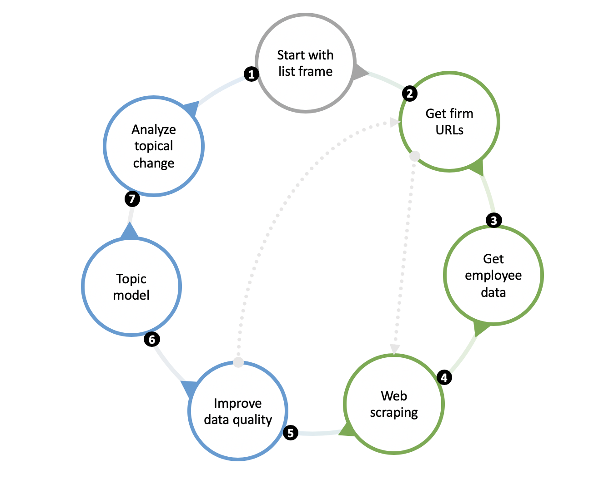
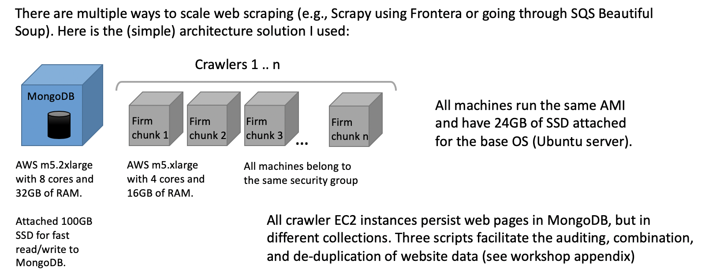

# The Web of Innovation: Using Website Data to Understand How Firms Innovate

Thanks for visiting this GitHub site!  I am PI on a small NSF grant and this code and data are available to anyone who wants to use or extend the repo to study small firm innovation.  Before you read any further, I suggest reviewing the companion site @ https://www.dextr.us/nsf-eager.  Here you'll find some background on why I started this work, as well as links to some other helpful resources, including a workshop that is aimed at a pedagogical introduction to the method. 

There is a companion paper currently being submitted to an academic journal.  Contact me if you would like a copy of the manuscript. 

## 1. What does the code do? 

Much of this project is about collecting web and search engine data to produce a cross-sectional view of a firm's online presence.  After having done similar work in the past and coming across a host of data access and data quality issues, I wanted to first build an open-source process for collecting important variables to produce a sample frame. Then, the code goes out and scrapes websites.  With some reasonable assurances that the data are of good quality (and don't cost an arm and a leg!), we are able to move to analysis.  This project covers all aspects of this journey, but not everything is automated.  Rather, what you'll find is a framework covering seven main steps in the research design, as follows.  I anticipate the first few steps to be of most interest/help to other researchers looking to leverage the same frame generation and data collection process for their work.

1. The code assumes you start with a frame list of firms.  I got my initial list by identifying patent assignees in three high-technology areas, nanotechnology, synthetic biology, and renewable energy.  But you could produce a frame list in some other way, e.g., a list of firms that contract with the US government (via SAM.gov) or a list of firms that have published journal articles. 
2. Next, we go out and get firm URL information by plugging in the firm name in a search engine, namely MS Bing.  How can we determine which firm URL is the right one, since the first firm URL in a search result list may produce false positives? We use machine learning methods to address this challenge. 
3. How can I tell whether a firm is small or not?  On one hand, you could purchase this information, just like firm URLs.  Or you could turn to search engines and use commonly available sources.  We use this second tactic and scrape firm search results from Google's Custom Search API.  You still have to pay a nominal amount to access Google's API, but it's much cheaper than buying these data from a proprietary business database vendor. 
4. Now that we've developed our final sample frame, we can turn to web scraping using the Python open-source library, Scrapy.  We also use MongoDB community edition, a document-based database that can store webpage data using JSON. 
5. Website data are messy, but we can improve data quality to prepare for additional analysis.  One of the things we do at this stage is develop a machine learning model to identify only certain pages of interest, e.g., firm 'about us' pages.  We can go back and recrawl these 'about us' pages as needed.  Then, we can remove code snippets, copyright information, headings, and any other text that may add unnecessary noise.  The caveat here is that noise to you may not be the same thing as noise to me.  As you'll see I'm using the unstructured text for topical analysis, so I don't care much about menu items and related text.  For your work, you may care about a website's structure. 
6. Topic model the cleaned website data by industry, and visualize those topics
7. Develop a method for analyzing topical change from one paragraph to another.  Here, I focus on entrepreneurial narratives as my theoretical framework.

Traditionally when writing research papers, we would motivate the research question (#7) and then produce a research design that helps  answer that question.  The above steps are presented somewhat backwards from a social science perspective, yet I think it follows the computer science literature in its engineering, practical-application focus.  I have learned that when presenting this work, audience definitely matters.  Feel free to contact me if you would like an in-person introduction over phone/video and screen share.

## 2. How do I get started? 

The workshop materials, available at https://www.dextr.us/workshop-resources, include a getting started guide.  You can follow this from start to finish if you would like to download the course workshop slides and virtual machine and follow steps 1-7 sequentially.  Just note that the workshop doesn't have the most recent code (it dates back to December 2019).  The workshop assumes a basic understanding of Python, R, and Unix commands. 

For those of you interested in just one or some of the steps above, e.g., collecting firm employment data or website URLs, you might want to  set up your API keys for Google and/or Microsoft and then jump straight to cloning the main branch of this repo and heading  to the code that you're interested in. In other words, because the code is organized in loosely connected modules, you can jump in at any point.  What follows is a step-by-step guide for doing exactly this. However, this track assumes basic to intermediate understanding of Python, R, Unix commands, Amazon Web Services, etc. 

If you would like to become a contributor and share your code back with the broader community, just let me know. 

## 3. Installation 
Choose one of three options: 

1. Follow the workshop getting started guide linked to from the bottom of [this page](https://www.dextr.us/workshop-resources "Workshop Resources")
2. Install the supporting tools, databases, and frameworks on your local system. Mac OS or Linux strongly recommended. (Native Windows compatibility has not been tested and is not supported.) 
3. Use the Amazon Web Services AMI to spin up an EC2 instance

Generally, I've found it easier to perform most of the analysis on my local machine but scrape on the cloud using the AMI image on EC2.  This is because scraping can take a long time to complete, and you don't necessarily want to be doing that on a laptop that you open and close often.  Plus, you can parallelize scraping on the cloud with multiple virtual machines, thus saving a lot of time. See below for details. 

Also note you'll need to create Bing and Google Custom Search API keys.  Consult the workshop getting reference guide for more information. 

### 3.1. Local system installation
1. First, clone this GitHub repo in a local directory of your choosing
2. [Install](https://docs.mongodb.com/v3.2/administration/install-community/ "MongoDB installation") MongoDB community edition 
3. You may want to install a MongoDB client, such as [Robo 3T](https://robomongo.org/ "Robo 3T")
4. [Install](https://jupyter.readthedocs.io/en/latest/install.html "Jupyter") Jupyter notebook
4. Install [R]("https://www.r-project.org/" R) and [RStudio](https://www.rstudio.com/products/rstudio/download/#download "RStudio").  Any .R scripts you may wish to use will require library installation, but that is fairly easy to do via the RStudio interface  
5. [Install](https://www.seleniumhq.org/download/ "Selenium") geckodriver for use in the web scraper.  I recommend performing all web scraping via the AMI, as noted above.   
5. There are a number of Python libraries that can be installed via pip or through anaconda. I am working on a requirements.txt file which can be sourced to install all libraries at the same time.  In the meantime, before running each Python script or interactive notebook, make sure each library is installed ahead of time.  (You will get error messages if something is missing.)

If there is anything missing from this list, please let me know. 

### 3.2. Amazon Machine Image (AMI) installation
1. Here, you'll need to create an AWS account and spin up an EC2 instance from a known AMI.  See [this page](https://docs.aws.amazon.com/AWSEC2/latest/UserGuide/finding-an-ami.html#finding-an-ami-console "Lookup an AMI") for general instructions.  Search for "EAGER_scraper" and continue the process of launching your EC2 instance.  (Note you only need one 100GB volume to store your collected website data in MongoDB. You can accept all other defaults.)
2. Mount your primary database volume to your new virtual machine.  See [these](https://devopscube.com/mount-ebs-volume-ec2-instance/ "Mount EBS drive to EC2") instructions. Create a symlinked directory /eager on your base virtual machine pointing to your database volume 

If there is anything missing from this list, please let me know. 

## 4. Scaling on AWS

How can we scale up and run multiple crawlers on the cloud?  This diagram shows a simple solution.  It also highlights different configurations of EC2 image types to build a cluster of loosely connected crawlers. 

## 5. Running code for specific steps in the research design method

Note that for each file you want to run, you may need to change file paths.  Also before getting started, make sure you have a good plan to keep unique identifiers in all the files you create so that you can join the data together before all is said and done. 

### 5.1. Identifying URLs
You may want to go through the workshop slides to get a better idea of what is going on here.  Here are some brief pointers to files:

1. Turn to the `code/urls` directory.  Start with `bing.py` to collect firm-specific search results from Bing and store them in MongoDB.  Remember to update your Bing search API key.  After running this file successfully, take a moment to examine the data in your MongoDB collection. 
2. Next run `python build-url-training-matrix-v2.py` in either `-t` or `-v` mode in a command line window. `-v` fetches data from MongoDB and joins it with labeled data to produce a trained model.  `-t` mode allows you to run unlabeled data in predict mode once you have a trained model.  That is, `-t` doesn't join in labeled data.  To expedite things a bit, you may want to just train your model on the labeled data that I've produced. 
3. Run all cells in the `url-prediction-model-v4` notebook.  Again, you can train your model on previously labeled data.  You'll definitely want to change the input file to make predictions using your specific frame list, however. The purpose of this step is to come up with URLs that you'll want to confirm (probably by hand) and then crawl (if everything looks okay).
4. There is a second series of steps that can be run here to identify 'about us' pages of interest for further data collection.  This goes beyond finding a firm's base (home) url by looking for specific subpages of interest. More on that later. 

### 5.2. Getting firm size (number of employees)
This step is much less complicated than the last one as there is no machine learning involved.  Go to `code/urls` and run the commands in the `collect-employee-data-v1` notebook.  Don't forget to update your Google Custom Search API key. 

### 5.3. Scrape websites
1. Navigate to `code/crawler/FirmDB` and in `settings.py`, point `INPUT_DATA` to your file.  Also set `FIX_URLS` to `True` and `ABOUT_MODE` to `False`.  (You can use Jupyter Notebook or your favorite editor to do this.)  The code is currently configured to scrape a single home page, but it's fairly easy to change this setting to crawl a full website.  While I've crawled many full websites in the past, I've found that focusing on just specific pages of interest is faster and provides better data quality. 
2. Navigate to `code/crawler` in a command line window, and run `scrapy crawl HTML --set="ROBOTSTXT_OBEY=False"`
3. Take a moment to see what your data look like in MongoDB. 

### 5.4. Clean up the data and prepare it for topic modeling 
Let's take a slight detour now.  Let's say that we don't want all pages on a firm's websites, but only those that are 'about us' in nature.  Follow these steps:

1. In `code/urls` run all cells in the notebook `find-about-pages-v3`.  This will identify candidate 'about us' pages.
2. Now go and crawl these new URLs following the same steps in Section 5.3.  Change `FIX_URLS` to `False` and `ABOUT_MODE` to `True`. 
3. Similar to the URL prediction step, we'd like to build an intelligent way to remove false positives, i.e., pages that look like they could be 'about us' pages but for some reason are out of scope.  (I've already produced the labeled data for which pages are in-scope and which ones are not.)  Go to `code/topics_markov` and run all cells in the notebook `extract-pages-from-mongo-v7-about`.  This will produce a number of output files, one per firm. 

Step 3 here also removes extraneous (e.g., garbled data, including code) from the output text. 

### 5.5. Topic model the data by industry
In `code/topics_markov`, run the notebook `topic-model-v2` to produce and visualize topic modeled website data from specific 'about us' pages. This will output a file for use in the next and final step. (Each line in the output file includes the primary topic of a given paragraph.)

### 5.6. Model the data using panel-based continuous Markov multi-state modeling 
In RStudio, open `MSM_v3.R`, also in `code/topics_markov`.  Don't forget to copy the column names from the notebook in Section 5.5. 

## 6. Can I extend this work for other domains?  What if I don't study small firms? 
Absolutely, the crawling code was modified from a school and district scraper.  At some level of abstraction, it doesn't matter if you're crawling a firm, university, hospital, government agency, or any other kind of site!  However, you'll need to modify the code to suite the unique circumstances of your research domain. 

## 7. I need help! 
No problem.  Contact me via [this form](https://www.dextr.us/about "Contact Sanjay") please.  I will do my best to respond within a couple of days. 
